# Face Attribute Editing

## Description

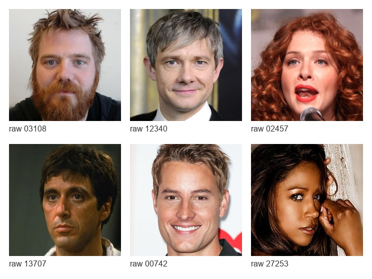

This project studies mask-based face attribute editing with diffusion LoRA
adapters. The goal is to change one requested facial attribute while preserving
identity, pose, background, and unrelated facial regions as much as possible.

**Problem definition:** given an input face image, a semantic edit task, and a
task mask, generate an edited image that satisfies the target attribute and
keeps the rest of the image close to the original.

Final tasks:

- `add_eyeglasses`
- `make_smiling`
- `make_older`

Final models:

- Stable Diffusion 1.5 LoRA (`sd15`)
- Stable Diffusion XL LoRA (`sdxl`)

Playground v2.5 was trained but excluded from the final report because its
inpainting outputs showed strong noisy artifacts.

## Selected Visual Results

Each panel is:

```text
original | sd15 best | sdxl best
```

Only the selected README examples below are intended for GitHub. Full generated
outputs stay local in `exports/` and are ignored by git.

### Add Eyeglasses

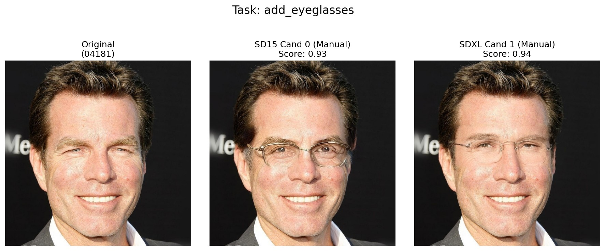

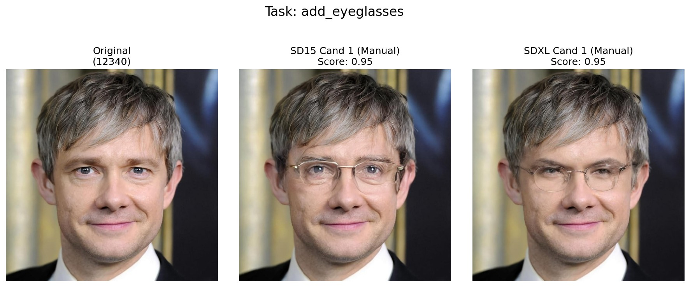

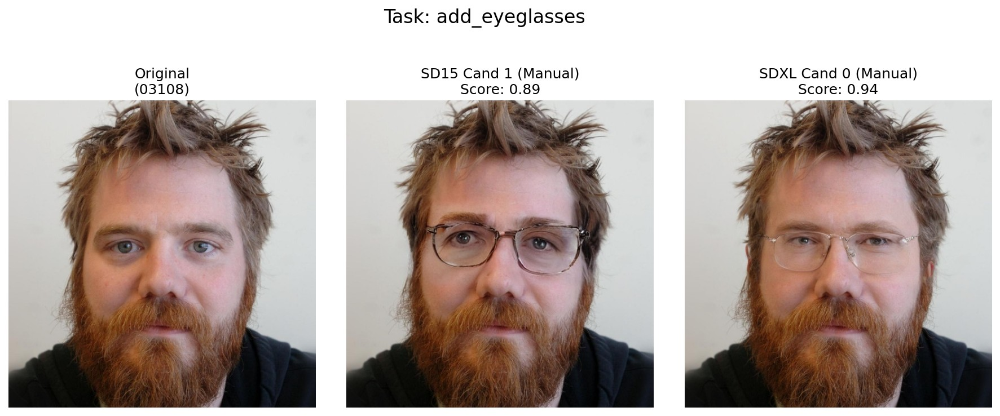

### Make Smiling

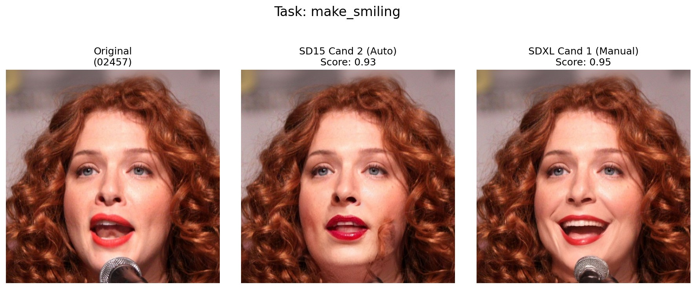

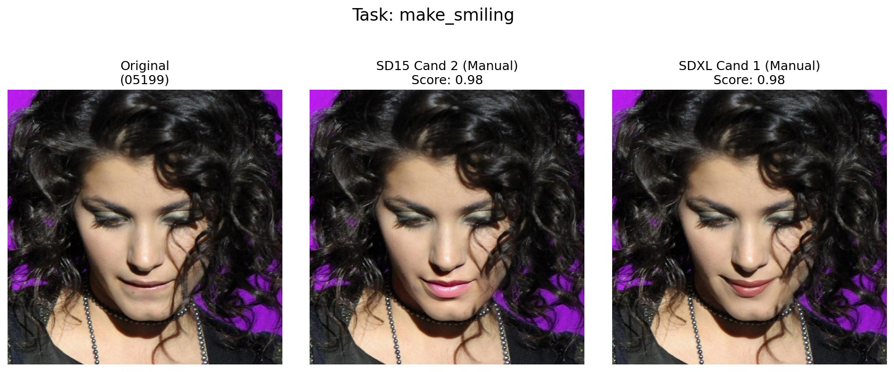

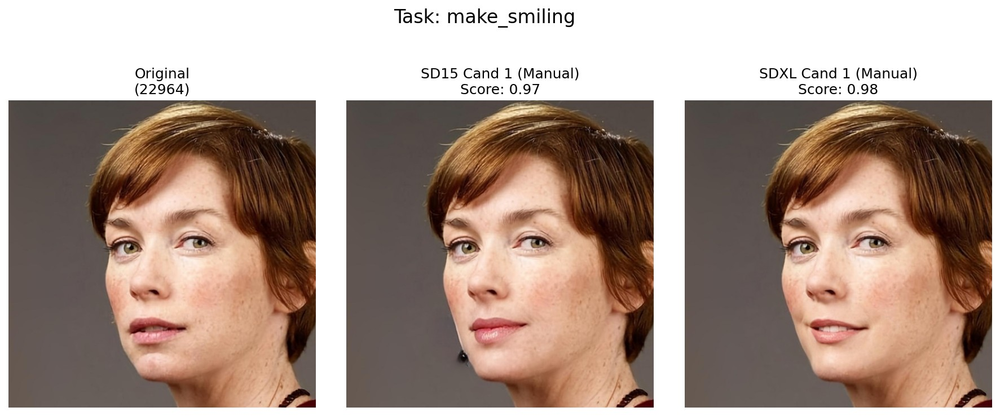

### Make Older

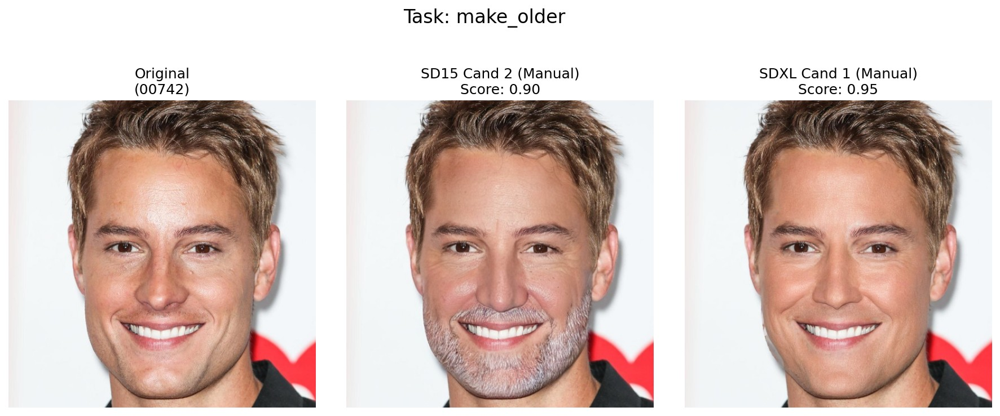

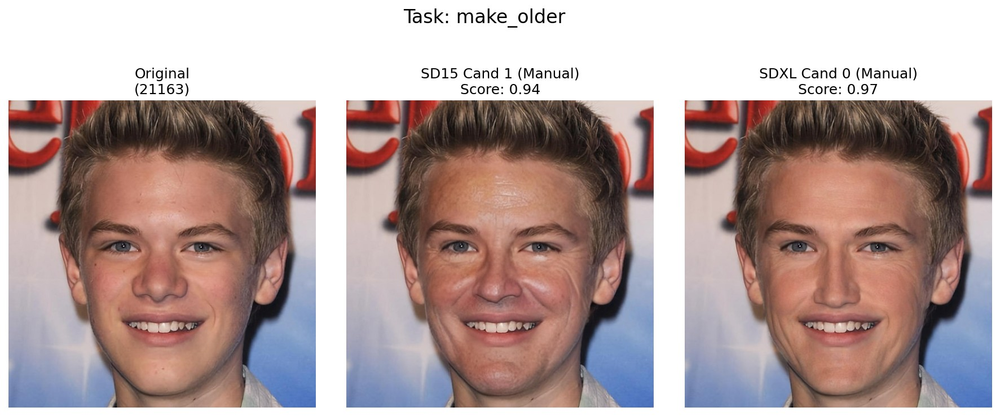

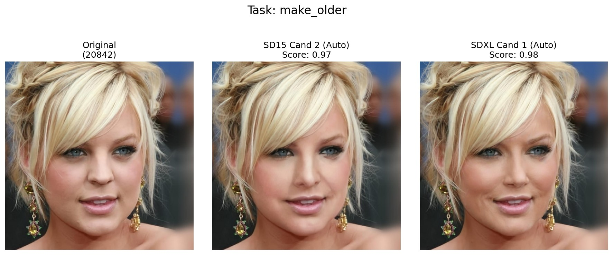

## Benchmark

The main benchmark should be computed from real output files:

```text
original image + task mask + edited best image + metadata
```

It should not be computed from README comparison panels. Panel-level pixel
metrics are kept only as an auxiliary preservation sanity check because they
penalize valid semantic edits.

### Metrics

- Hard attribute success rate: whether the classifier score crosses the task
  threshold. This is strict and can undercount visually plausible edits.
- Direction success rate: whether the classifier score moves in the requested
  direction by at least `0.05`. This is less brittle than the hard threshold.
- Attribute score mean: task-aware soft score; higher is better. For
  `make_older`, this is `1 - P(Young)`.
- Attribute delta mean: task-aware improvement from original to edited image.
- LPIPS: perceptual image change. Lower means the edited image is perceptually
  closer to the source.
- Background L1 and background SSIM: preservation outside the edit mask. These
  are more appropriate than whole-image L1/SSIM because the masked region is
  expected to change.
- Manual preference: human choice between model outputs. This is recommended
  for the final report because face editing quality is partly subjective.

### Current Status

Both SD 1.5 and SDXL edited-output zips were imported and reranked with
attribute-focused candidate weights:

```text
attr_score=0.70, attr_delta=0.15, background_score=0.10, lpips_score=0.05
```

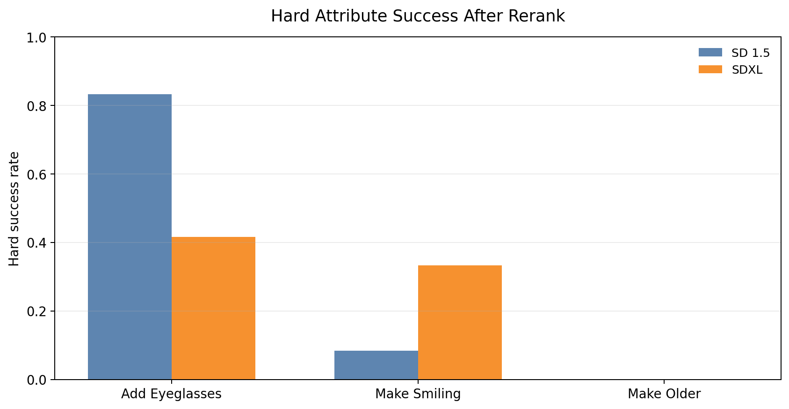

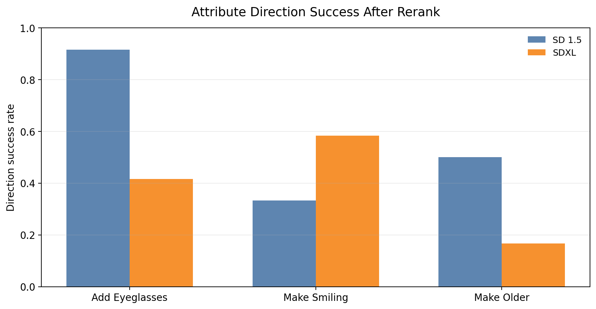

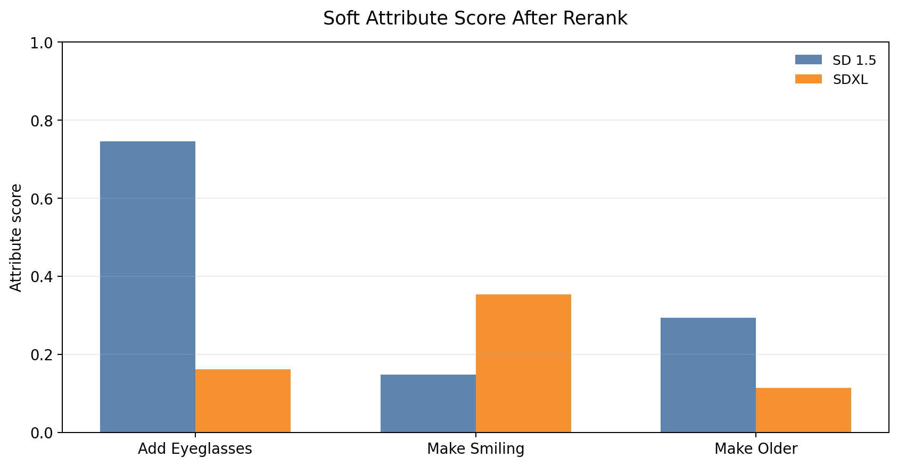

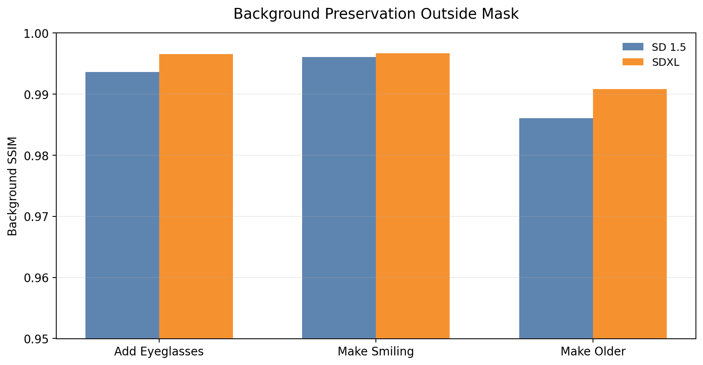

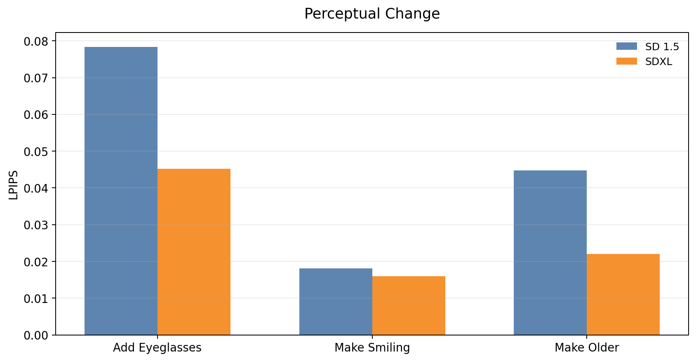

| Task | Model | N | Hard success | Direction success | Attr score | Attr delta | LPIPS | Background SSIM |
|---|---|---:|---:|---:|---:|---:|---:|---:|
| `add_eyeglasses` | SD 1.5 | 12 | 0.8333 | 0.9167 | 0.7452 | 0.7333 | 0.0783 | 0.9936 |
| `add_eyeglasses` | SDXL | 12 | 0.4167 | 0.4167 | 0.1610 | 0.1487 | 0.0452 | 0.9965 |
| `make_smiling` | SD 1.5 | 12 | 0.0833 | 0.3333 | 0.1479 | 0.0888 | 0.0181 | 0.9961 |
| `make_smiling` | SDXL | 12 | 0.3333 | 0.5833 | 0.3538 | 0.2967 | 0.0160 | 0.9967 |
| `make_older` | SD 1.5 | 12 | 0.0000 | 0.5000 | 0.2937 | 0.1732 | 0.0448 | 0.9861 |
| `make_older` | SDXL | 12 | 0.0000 | 0.1667 | 0.1132 | 0.0256 | 0.0220 | 0.9909 |

`make_older` still has zero hard-threshold success for both models. The soft
direction metrics show that SD 1.5 moves some samples in the intended direction,
but none cross the classifier's `Young` threshold. This should be interpreted as
a classifier-threshold result, not a manual visual preference score.

To reproduce the local benchmark:

```bash
python scripts/import_edited_outputs.py --source sd15-20260524T033232Z-3-001.zip --model-id sd15 --replace-model-dir
python scripts/import_edited_outputs.py --source sdxl-20260524T033538Z-3-001.zip --model-id sdxl --replace-model-dir
python scripts/rerank_candidates.py --model-id sd15 --model-id sdxl
python scripts/run_evaluation.py
```

Benchmark files:

- [`benchmark/comparison_table.csv`](benchmark/comparison_table.csv)
- [`benchmark/comparison_table.md`](benchmark/comparison_table.md)
- [`benchmark/ranking.csv`](benchmark/ranking.csv)
- [`benchmark/panel_preservation_summary.csv`](benchmark/panel_preservation_summary.csv)
- [`benchmark/panel_preservation_long.csv`](benchmark/panel_preservation_long.csv)
- [`benchmark/model_health_check.csv`](benchmark/model_health_check.csv)
- [`benchmark/selected_visual_index.csv`](benchmark/selected_visual_index.csv)

## Repository Structure

```text
configs/       Project configuration
src/           Data, training, inference, evaluation, and reporting modules
scripts/       CLI entry points
notebooks/     Notebook entry points
docs/assets/   Lightweight README images selected from final outputs
benchmark/     Lightweight benchmark CSVs and charts for GitHub
data/          Local data, ignored by git
runs/          Local training and inference outputs, ignored by git
exports/       Full final artifacts, ignored by git
```

## Demo

Run the Streamlit demo:

```bash
streamlit run streamlit_app.py
```

The demo has three pages:

- Benchmark Dashboard: shows the standard metric table, evaluation status, and
  available benchmark charts.
- Browse Final Comparisons: shows either the 9 README-selected examples or the
  full local `exports/visual_index.csv` if present.
- Interactive Editor: runs `sd15` or `sdxl` with local LoRA weights and a simple
  generated mask for custom uploaded images.

## Quick Start

Install dependencies:

```bash
pip install -r requirements.txt
pip install -e .
```

Run inference for the two final models:

```bash
python scripts/run_inference.py --model-id sd15
python scripts/run_inference.py --model-id sdxl
```

Run evaluation and benchmark scripts:

```bash
python scripts/run_evaluation.py
python scripts/run_benchmark.py
```

For Drive/GPU inference and final visual generation, use:

```text
Face_Attr_Edit_Run_Inference_Eval_From_Drive.ipynb
```

## Notes

- The full model weights are not tracked in git. They are available locally in
  `runs/face_attr_edit_v2_full_inpaint/loras/` and mirrored in
  `exports/best_loras/`.
- The public README uses only 9 selected comparison images from
  `exports/comparison_grids/individual`.
- `exports/`, `runs/`, and `data/processed/` stay ignored to avoid pushing
  heavy generated artifacts.

## License

MIT. See [LICENSE](LICENSE).
