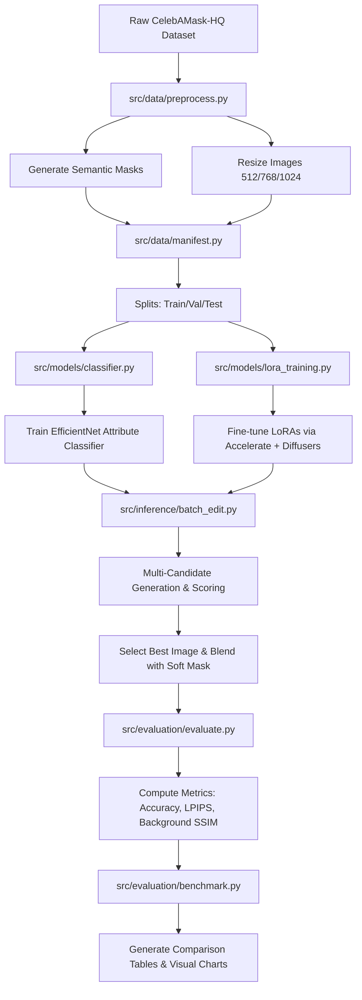

# Face Attribute Editing Benchmark 🚀

[](https://www.python.org/)
[](https://pytorch.org/)
[](https://github.com/huggingface/diffusers)
[](https://opensource.org/licenses/MIT)

This repository contains a modular, end-to-end pipeline for fine-tuning and benchmarking **3 diffusion backbones** for the task of **face attribute editing** using mask-native inpainting and soft blending:

1. **Stable Diffusion 1.5** (`sd15`)
2. **Stable Diffusion XL** (`sdxl`)
3. **Playground v2.5** (`playground25`) — *SDXL-compatible aesthetic model*

We support three key facial attribute editing tasks:
*   ➕ **Add Eyeglasses** (`add_eyeglasses`)
*   😊 **Make Smiling** (`make_smiling`)
*   🧓 **Make Older** (`make_older`)

---

## 📐 Architecture & Pipeline



---

## 📁 Repository Structure

```
face-attr-edit/
├── README.md
├── LICENSE
├── requirements.txt
├── setup.py
├── .gitignore
│
├── configs/
│   └── default.yaml              # Global settings, hyperparameters, prompt templates
│
├── src/                          # Modular core package
│   ├── __init__.py
│   ├── config.py                 # Paths setup, configurations loading
│   ├── data/
│   │   ├── download.py           # Dataset downloader
│   │   ├── preprocess.py         # Image cropping, resizing, mask building
│   │   └── manifest.py           # Train/Val/Test splitting, smoke datasets
│   ├── models/
│   │   ├── classifier.py         # Face attribute classifier (EfficientNet-B0)
│   │   └── lora_training.py      # Accelerate Diffusers LoRA trainer
│   ├── inference/
│   │   ├── pipeline.py           # Inpainting pipeline loader & blender
│   │   └── batch_edit.py         # Test-set batch editing, scoring candidates
│   ├── evaluation/
│   │   ├── metrics.py            # SSIM, L1, LPIPS, identity metrics
│   │   ├── evaluate.py           # Single-run evaluations
│   │   └── benchmark.py          # Multi-model comparisons & spider charts
│   └── visualization/
│       ├── plots.py              # Loss and metrics plotter
│       ├── qualitative_grid.py   # Side-by-side original/edited comparisons
│       └── report.py             # Markdown report compiler
│
├── scripts/                      # Command-Line Interfaces (CLIs)
│   ├── run_preprocessing.py      # Download, preprocess images and masks
│   ├── run_training.py           # Train classifier or LoRAs
│   ├── run_inference.py          # Run batch face edits on test set
│   ├── run_evaluation.py         # Compute evaluation metrics
│   └── run_benchmark.py          # Benchmark all runs together
│
├── notebooks/
│   └── face_attr_edit.ipynb      # Clean, sectioned Colab/Kaggle-ready notebook
│
└── exports/                      # Saved checkpoints and metrics
    ├── best_loras/               # Best LoRA weights (.safetensors)
    ├── results_summary.csv       # Unified summary metrics
    └── final_report.md           # Markdown report containing environment info & results
```

---

## 🚀 Quick Start

### Installation

First, clone this repository and install it in editable mode:
```bash
pip install -r requirements.txt
pip install -e .
```

### 1. Data Preprocessing
Run the preprocessing script to download, crop, and build the target masks:
```bash
# Process a subset (smoke test)
python scripts/run_preprocessing.py --max-images 200 --smoke

# Run full preprocessing (2000 images)
python scripts/run_preprocessing.py --max-images 2000
```

### 2. Training
Train the face attribute classifier first (used for candidate selection and evaluation):
```bash
python scripts/run_training.py --classifier
```

Then train the LoRA adapter for a specific model (e.g., `sd15`):
```bash
python scripts/run_training.py --model-id sd15
```

### 3. Batch Editing & Inference
Run inference to edit the test set images:
```bash
python scripts/run_inference.py --model-id sd15
```

### 4. Evaluation
Evaluate the generated outputs against ground truth metrics:
```bash
python scripts/run_evaluation.py
```

### 5. Benchmark Comparison
Generate cross-model benchmark reports, spider plots, and comparison tables:
```bash
python scripts/run_benchmark.py
```

---

## 📊 Benchmark Results

Here is the current comparison summary of the evaluated backbones:

| Task | Model | N | Attr Success ↑ | LPIPS ↓ | Background L1 ↓ | Background SSIM ↑ | Selection Score ↑ |
|:---|:---|:---:|:---:|:---:|:---:|:---:|:---:|
| **Add Eyeglasses** | **SD 1.5** | 12 | 0.6667 | 0.0625 | 0.0009 | 0.9961 | 0.5481 |
| | SDXL | — | *pending* | *pending* | *pending* | *pending* | *pending* |
| | Playground v2.5 | — | *pending* | *pending* | *pending* | *pending* | *pending* |
| **Make Smiling** | **SD 1.5** | 12 | 0.0833 | 0.0177 | 0.0007 | 0.9975 | 0.4549 |
| | SDXL | — | *pending* | *pending* | *pending* | *pending* | *pending* |
| | Playground v2.5 | — | *pending* | *pending* | *pending* | *pending* | *pending* |
| **Make Older** | **SD 1.5** | 12 | 0.1667 | 0.0675 | 0.0053 | 0.9833 | 0.5103 |
| | SDXL | — | *pending* | *pending* | *pending* | *pending* | *pending* |
| | Playground v2.5 | — | *pending* | *pending* | *pending* | *pending* | *pending* |

*Note: SDXL and Playground v2.5 evaluations will populate automatically once inference/evaluation is run for them. Best LoRA weights for SD 1.5 and SDXL are already located in `exports/best_loras/`.*

---

## 📝 License

This project is licensed under the MIT License - see the [LICENSE](LICENSE) file for details.
